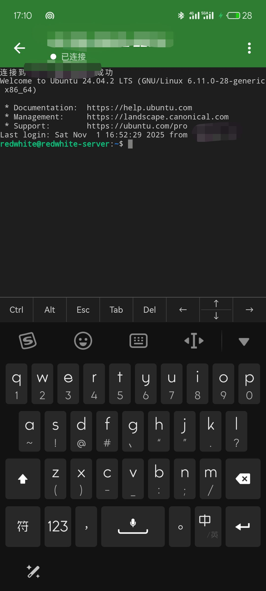
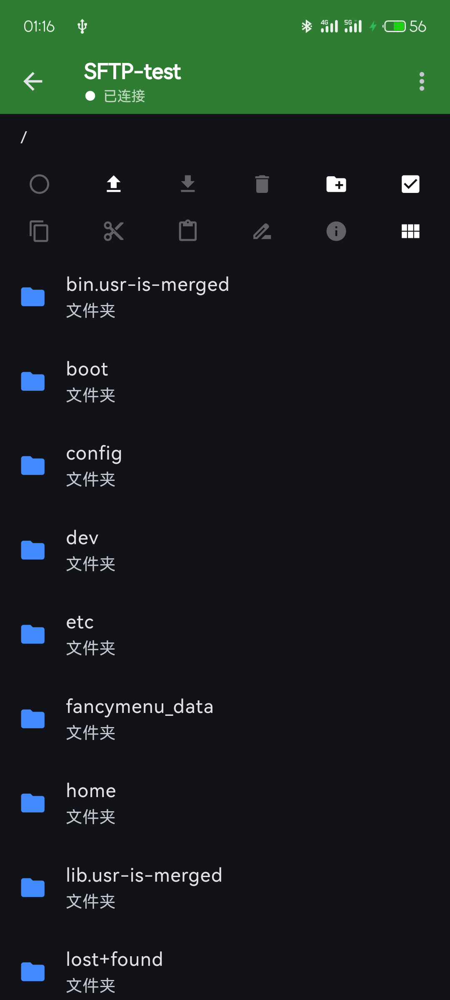
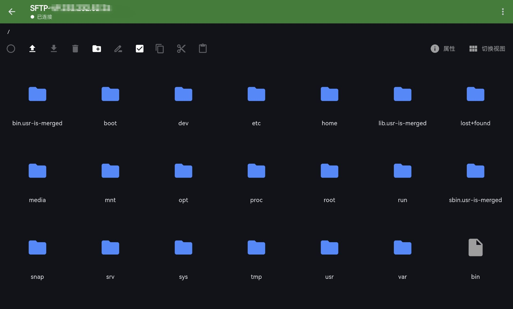

# Connecter  
A lightweight & cross-platform SSH/SFTP client built with Flutter.
一个基于Flutter的，轻量、跨平台的SSH/SFTP工具

### 特性
- 完整 SSH 终端（快捷键、手势滚动、字号缩放）
- 完整 SFTP：批量文件操作，支持自定义默认访问目录
- 响应式布局：多尺寸设备自适应
- 跨平台：Android / Windows / iOS(ToDo) / HarmonyOS(ToDo)
- 支持私钥 / 密码 认证

### 下载
| 平台 | 下载 | 备注 |
|------|------|------|
| Android | [APK](https://github.com/RWPteam/connecter/releases/download/1.0Beta5/1.0Beta5_android_arm64.apk) | arm64-v8a，更多架构查看Release |
| Windows | [exe](https://github.com/RWPteam/connecter/releases/download/1.0Beta5/1.0Beta5_windows_x64.exe) | 仅支持64位设备 |

### 构建&打包
* 需注意，本项目使用了修改过的[xterm.dart](https://github.com/samu1oto/xterm.dart)以添加快捷操作栏等功能
* 本项目使用了[openharmony-tpc/flutter_flutter](https://gitcode.com/openharmony-tpc/flutter_flutter/tree/br_3.22.0-ohos-1.0.4)而非正常版本的flutter，不保证正常版本下可用

```bash
# 源码运行（Flutter ≥ 3.22）
git clone https://github.com/RWPteam/connecter.git
cd connecter
flutter pub get
flutter run -d <device_id>
```

```bash
# Android
flutter build apk --split-per-abi
# Windows
flutter build windows
# HarmonyOS
flutter build hap
# or
flutter build app
```
### ToDo
已迁移至 [GitHub Issues](https://github.com/RWPteam/connecter) 

### 开源协议
MIT © 2025 RWPteam

### 截图
| 手机端SSH | 手机端SFTP |
|-----------------|--------------|
|  |  | 

### 感谢
- [xterm.dart](https://github.com/TerminalStudio/xterm.dart) – terminal UI
- [dartssh2](https://github.com/TerminalStudio/dartssh2) – SSH/SFTP engine
